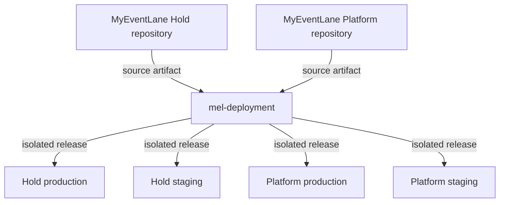
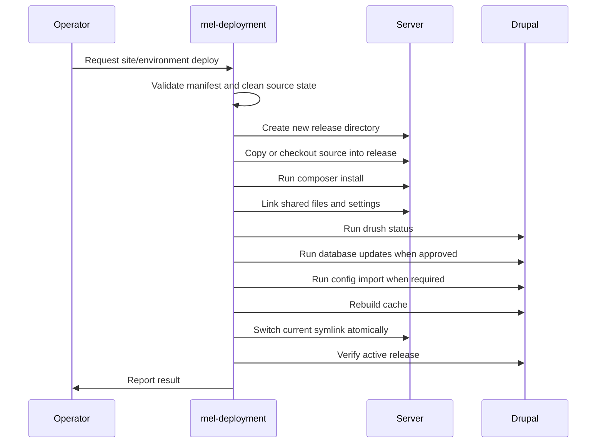
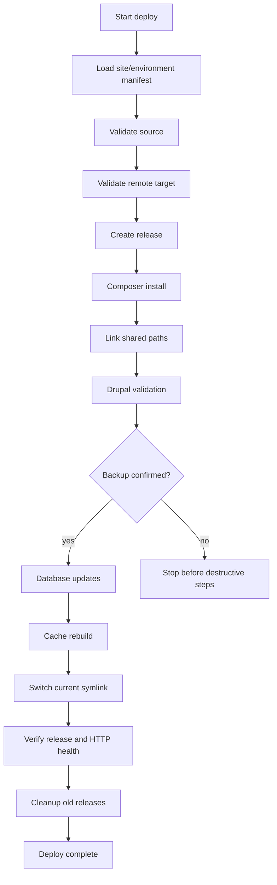

# Deployment Redesign

## Purpose

This document designs a deployment architecture for multiple independent Drupal installations without sharing deployment logic inside either Drupal repository.

The design supports:

- MyEventLane Hold
- MyEventLane Platform

This is documentation only. It does not create a deployment repository, alter deployment scripts, change Drupal runtime behaviour, change themes, change modules, or modify Commerce.

## Confirmed Starting Point

Confirmed from this repository:

- MyEventLane Hold is a Drupal 11 Composer project.
- Deployment scripts currently live inside the Hold repository under `deploy/`.
- The current scripts are holding-site specific.
- No `.github/` workflows were found in this repository.
- The future Platform repository was not present in this repository and was not audited.

Unconfirmed and not assumed:

- The contents of the future Platform repository.
- The production server's current final directory layout.
- The staging server's current final directory layout.
- The existence of CI, hosting panels, backups, or deployment accounts outside this repository.

## Target Architecture

Deployment infrastructure should move to a separate repository named `mel-deployment`.

The Drupal repositories should own application source, Composer metadata, and Drupal configuration. They should not own server deployment, release management, rollback, SSH orchestration, rsync rules, or server bootstrap scripts.



## Proposed `mel-deployment` Repository

Proposed structure:

```text
mel-deployment/
  .github/
    workflows/
      deploy.yml
      validate.yml
  deploy/
    sites/
      hold.yml
      platform.yml
    environments/
      production.yml
      staging.yml
    templates/
      nginx/
      php-fpm/
    lib/
      validate.sh
      release.sh
      rollback.sh
      cleanup.sh
      drupal.sh
      ssh.sh
    bin/
      deploy
      rollback
      verify
  docs/
    architecture.md
    operations.md
    runbooks/
      production-deploy.md
      staging-deploy.md
      rollback.md
      disaster-recovery.md
  scripts/
    bootstrap-host.sh
    check-host.sh
  README.md
```

This structure is illustrative. Exact filenames should be confirmed when `mel-deployment` is created.

## Repository Responsibilities

### MyEventLane Hold

Owns:

- Drupal 11 application code.
- `composer.json` and `composer.lock`.
- Drupal configuration in `config/sync`.
- Custom modules.
- Custom themes.
- Application documentation.
- Local development documentation.

Does not own:

- Server deployment orchestration.
- Release directory management.
- Rollback commands.
- Infrastructure provisioning.
- SSH target definitions.
- Rsync deletion policy.
- Production or staging server paths.
- Server-level shared file layout.

### MyEventLane Platform

Expected future responsibility model:

- Own Drupal application code, Composer metadata, and Drupal configuration for the Platform repository.
- Do not own server deployment orchestration, release management, rollback, or infrastructure.

No assumptions are made about Platform modules, themes, Commerce usage, content model, routes, config, or deployment needs because that repository was not audited in this phase.

### `mel-deployment`

Owns:

- Site and environment manifests.
- Deployment validation.
- Source checkout or source artifact preparation.
- Composer install strategy for releases.
- Shared directory wiring.
- Release activation.
- Rollback orchestration.
- Cleanup policy.
- SSH execution.
- Environment isolation.
- Release health checks.
- Operational runbooks.

Does not own:

- Drupal business logic.
- Drupal modules.
- Drupal themes.
- Drupal content modelling.
- Drupal Commerce implementation.
- Application-specific configuration values, except deployment metadata needed to locate and verify releases.

## Site and Environment Isolation

Each site/environment combination should have an explicit manifest.

Example only:

```yaml
site: hold
environment: production
repository: git@github.com:example/myeventlane_hold.git
branch: main
deploy_user: mel_hold_deploy
host: hold-production.example
base_path: /var/www/mel/hold/production
public_url: https://myeventlane.com.au
environment_file: /etc/mel/hold/production.env
web_root: web
```

The manifest should use allowlisted paths. Deployment must fail if a path is empty, root-like, not absolute, not owned by the expected deploy user, or not registered for that site/environment.

Hold and Platform must have separate:

- Source repositories.
- Base paths.
- Release directories.
- Shared directories.
- Environment files.
- Deploy users or deploy identities where possible.
- Logs.
- Backup markers.
- Health check URLs.

## Release-Based Deployment Model

Each site/environment should use a release layout.

Example only:

```text
production/
  repo/
  releases/
    20260702T120000Z/
    20260702T130000Z/
  shared/
    files/
    private/
    settings/
    logs/
    backups/
  current -> releases/20260702T130000Z

staging/
  repo/
  releases/
    20260702T120000Z/
  shared/
    files/
    private/
    settings/
    logs/
    backups/
  current -> releases/20260702T120000Z
```

The exact server root is not assumed. The pattern is the requirement, not the literal path.

## Release Lifecycle



Lifecycle stages:

1. Select site and environment from a manifest.
2. Validate local or CI source state.
3. Validate remote host, user, paths, and required tools.
4. Create an immutable release directory.
5. Place source code into the release directory.
6. Run `composer install --no-dev --optimize-autoloader --no-interaction` inside the release.
7. Link shared runtime paths into the release.
8. Load the environment file for the selected site/environment.
9. Run Drupal pre-activation checks.
10. Run database updates only after backup or explicit backup confirmation.
11. Run config import when appropriate for that application.
12. Rebuild cache.
13. Atomically update `current`.
14. Verify public and server-side health.
15. Mark the release successful.
16. Clean old releases according to retention policy.

## Shared Configuration

Shared content should live outside immutable releases.

Typical shared items:

- `web/sites/default/files`
- `private`
- `web/sites/default/settings.production.php`
- Environment file outside the web root.
- Logs.
- Backups.

The deployment repository should define shared paths per site/environment. It should not infer shared paths from another site.

Shared path rules:

- Shared directories must be absolute and allowlisted.
- Shared directories must not be nested inside another site's release tree.
- Shared files must never be copied from a developer machine if they contain secrets.
- Settings and environment files must be created manually or by a secure provisioning process, not by committing secret values.

## Deployment Flow



## Validation Design

Required validation before deployment:

- Clean git working tree.
- Correct branch or commit selected.
- `composer validate` passes.
- `composer.lock` exists and is consistent with `composer.json`.
- Required Drupal files exist, including `composer.json`, `composer.lock`, `web/index.php`, `web/core`, `config/sync`, and `vendor/bin/drush` after Composer install.
- Site/environment manifest exists.
- Target host, deploy user, base path, release path, shared path, and current symlink path are allowlisted.
- Target paths are absolute and not root-like.
- Remote target belongs to the selected site/environment.
- Environment file exists on the server and has safe permissions.
- Required secret names are present without printing secret values.
- Composer install succeeds in the release.
- `drush status` succeeds for the release.
- Database backup is confirmed before `drush updatedb`.
- Database updates succeed.
- Config import succeeds when that deployment type requires it.
- Cache rebuild succeeds.
- HTTP health check succeeds against the environment URL.
- `current` symlink points to the expected release.
- Active release marker matches the deployed release.

Validation should fail closed. Production deployment should not continue when required validation fails.

## Validation Sequence

Recommended production sequence:

1. Validate deployment manifest.
2. Validate clean source state.
3. Validate Composer metadata.
4. Validate remote host and paths.
5. Create release.
6. Install dependencies.
7. Link shared files.
8. Run `drush status`.
9. Confirm backup checkpoint.
10. Run database updates.
11. Run config import when required.
12. Rebuild cache.
13. Activate release symlink.
14. Verify symlink.
15. Verify Drupal reports expected active release.
16. Run HTTP health check.
17. Record deployment result.

## Rollback

Rollback should switch `current` back to the previous known-good release.

Rollback requirements:

- Keep a minimum number of previous successful releases.
- Record release metadata: site, environment, commit, deployment time, operator, and validation status.
- Do not delete the previous release until the new release passes verification.
- Verify the target rollback release exists and belongs to the same site/environment.
- Switch `current` atomically.
- Rebuild caches if required by Drupal state.
- Run server-side and HTTP verification after rollback.

Rollback limitation:

- Code rollback does not automatically roll back database schema or content changes. Any deployment that runs database updates must have a backup and restore plan.

## Disaster Recovery

Disaster recovery should be documented per site/environment in `mel-deployment`.

Minimum recovery requirements:

- Restore source release from git or release artifact.
- Restore `shared/` files from backup.
- Restore private files from backup.
- Restore database from backup.
- Restore environment file from secure secret storage.
- Recreate `current` symlink.
- Run `composer install` if vendor is not part of the restored artifact.
- Run `drush status`.
- Run `drush cr`.
- Run HTTP health check.

The deployment repository should document where backups are expected, but it should not store backup contents or secrets.

## Cleanup

Cleanup should run only after a successful deployment.

Recommended retention:

- Keep the current release.
- Keep the previous known-good release.
- Keep a small configurable number of older successful releases.
- Keep failed releases only long enough for diagnosis.

Cleanup must never operate outside the allowlisted `releases/` directory for the selected site/environment.

## Production Deployment

Production deployment should be conservative.

Production requirements:

- No dirty source state.
- No skipped validation.
- No skipped verification.
- Backup confirmation before database updates.
- Explicit site/environment selection.
- Public HTTP health check.
- Release symlink verification.
- Deployment log retained.
- Rollback target retained.

Production must not share release directories, shared directories, or environment files with staging or Platform.

## Staging Deployment

Staging should use the same release model as production.

Staging differences may include:

- Different branch or commit policy.
- Different environment URL.
- Different environment file.
- Different database.
- Different shared files.
- Different retention policy.
- Optional HTTP authentication or network restriction, if configured outside Drupal.

Staging must remain isolated from production and must not be protected only by UI conventions.

## Future Multi-Site Support

Future multi-site support should be manifest-driven.

The deployment tool should require:

- Site key, such as `hold` or `platform`.
- Environment key, such as `production` or `staging`.
- Repository URL.
- Branch or commit.
- Host.
- Deploy user.
- Base path.
- Shared path.
- Public health check URL.
- Drupal web root.
- Environment file path.

The deployment tool should not hardcode Hold paths into Platform deployment or Platform paths into Hold deployment.

Adding a new site should mean adding a new manifest and runbook, not copying and editing application repository scripts.

## Security Controls

Required controls:

- No hardcoded credentials.
- No secrets in git.
- No printing secret values.
- Allowlisted remote paths only.
- Refuse empty paths, `/`, `/home`, `/var`, and other broad parent paths.
- Refuse paths owned by unexpected users.
- Refuse deployment when the manifest site/environment does not match the target marker file.
- Avoid in-place `rsync --delete` against an active document root.
- Avoid recursive ownership changes outside an allowlisted release/shared path.
- Require backup confirmation before database updates.
- Fail on config import failure.
- Make verification mandatory for production.
- Keep deployment logs without secrets.

## Configuration Awareness

Drupal config is application-owned.

Deployment should:

- Treat `config/sync` as part of the application release.
- Detect whether config import is required.
- Fail loudly when config import fails.
- Report `drush config:status`.
- Avoid making ad hoc config changes during deployment.

Deployment should not:

- Edit Drupal configuration files.
- Create new Drupal fields, routes, modules, themes, or Commerce settings.
- Change active Drupal configuration outside the agreed deployment steps.

## Drupal 11 and Commerce 3 Safety

This design is safe for Drupal 11 because it uses Composer, Drush, immutable releases, shared runtime directories, and standard cache/config/update steps.

This design is Commerce 3 safe because it does not assume Commerce exists in Hold and does not introduce Commerce-specific deployment behaviour. If Platform uses Commerce 3 in future, its repository should own Commerce code and configuration, while `mel-deployment` should only run the agreed Drupal deployment lifecycle for that site.

## Operational Runbooks

`mel-deployment` should include runbooks for:

- Production deployment.
- Staging deployment.
- Rollback.
- Failed Composer install.
- Failed database update.
- Failed config import.
- Failed cache rebuild.
- Failed HTTP health check.
- Disaster recovery.

Each runbook should include:

- Preconditions.
- Commands.
- Expected output.
- Stop conditions.
- Escalation path.
- Rollback or recovery steps.

## Migration From Current State

Recommended phased migration:

1. Keep current Hold deployment scripts unchanged while documenting the new architecture.
2. Create `mel-deployment` separately.
3. Move deployment knowledge into manifests and runbooks.
4. Implement validation without changing Drupal runtime behaviour.
5. Implement release directory creation for staging first.
6. Prove staging rollback.
7. Prove production dry-run validation.
8. Cut production over to release-based deployment.
9. Remove or deprecate application-repository deployment scripts only after the new process is proven and approved.

No repository or script changes are made by this document.

## Phase 1 Validation Results

Repository-safe validation was run from the MyEventLane Hold repository root.

Passed:

- `composer validate`
- `git diff --check`
- `bash -n deploy/*.sh`

Not run:

- `shellcheck deploy/*.sh`

Reason:

- ShellCheck is not installed in the local environment. This is recorded and is not treated as a failure.

## Design Outcome

The deployment architecture should be separated from application code by moving deployment ownership into `mel-deployment`.

The new model should deploy each site/environment into isolated releases, link shared runtime state explicitly, activate through a `current` symlink, verify the active release, and retain previous releases for rollback.

This avoids one Drupal installation's deployment logic affecting another installation and gives Hold and Platform independent, reviewable, and recoverable deployment paths.
